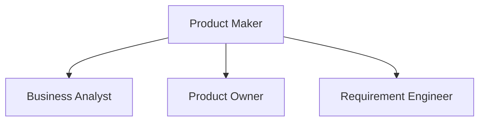
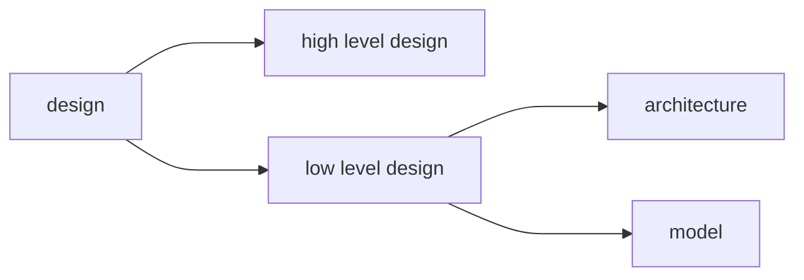
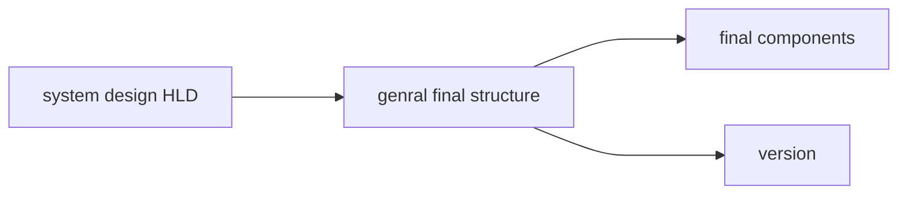
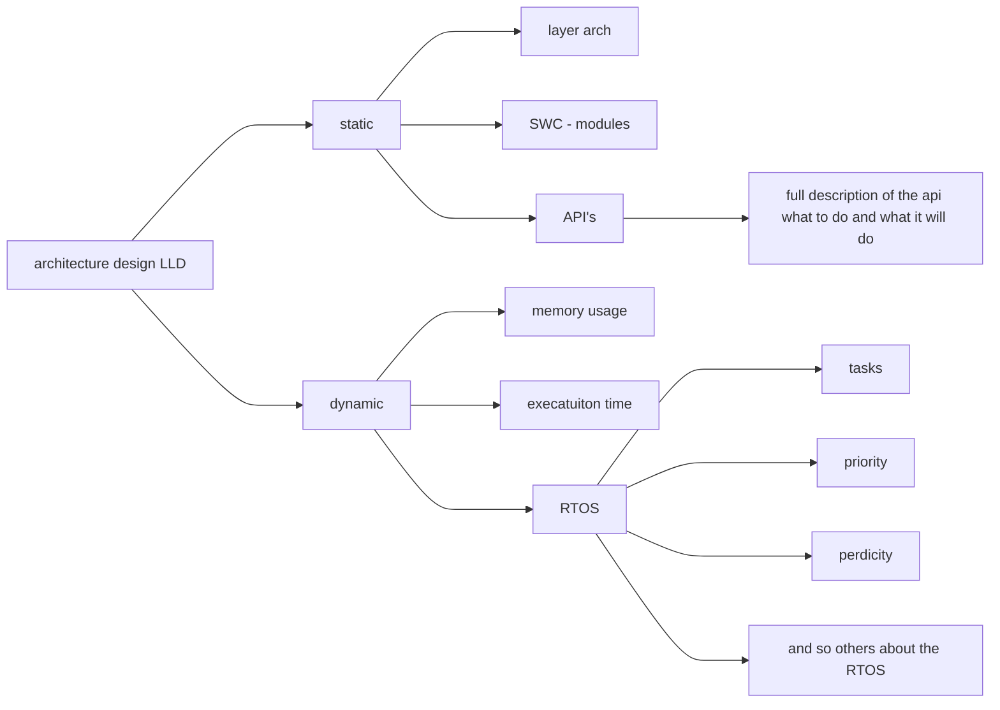
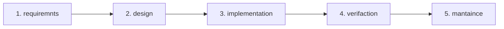
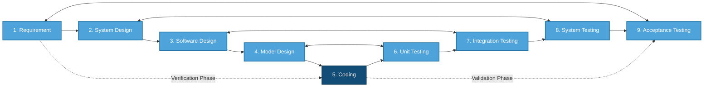

# SDLC : software devlopemnt life cycle

## points of intererest :
- what is SDLC ? 
- why is it importnat
- SDLC phases (deeper)
- SDLC model 
    - catagory 
    - models 

## what is SDLC and why is it important 

### proplem that might occuer 

1. chaos and randomens as anyone can create anything wihtout any guidelines
2. misunderatnding to the porject and between the team
3. detilas fall off as you dont know the requirments of each project 
4. alot of bugs as the implemtanion between each things will not work 100% good

so **SDLC** is the software dev life cycle to build software system (framwork in simplier terms) 

| without SDLC | with SDLC |
| :--- | :--- |
| multi workflow | one workflow |
| no documentation | qulaity code |
| alot of bugs | tracking |
| no maintence | more clear |

### SDLC phases 

# 1. defination & planning

    - client -> idea -> wants it to work -> project overview
        - planning -> time to do the work -> bugdet of the porjec -> to do the project or not 
            - project charter
        - defination of the project in clear 
            - client with product maker : 


- after all that the output is CRS (costumer req specification)
    - this goes to the cheaf eng. he sees if the product can be done using H.W or S.W 
    - after he is done he gives us a SRS (software reqiermnet speicafation) and HRS (hardware...)

# 2. Req. analysis 
there are the HW team and SW team and valaditon team 
they recive the SRS HRS and CRS(optional)

team lead of HW , SW , testing will take all these files and that the chef eng didnt make a mistake so we can accept and reject an requiermnt 

## rejection reasons 

```
1. no enoguh exp 
2. req opposties another 
3. no tool enviroments to testing 
the workflow happens :
rej -> cheaf eng -> req. eng -> client 
- X <- analyze <- SRS   <-  CRS
```
```
req. type :
|_> functional req : what system does 
|_> non- functional req : perferomace and quality and safty 
```

# 3. design 







# modeules design

then we create a **flowchart** made in **UML** unified modeling language it has flowcharts , static maciences , class
after all the HLD and LLD and UML diagraims we get an output so that we are fisnhed with design 

# 4. implementation 

after we done all of thse we create the code for the system

# 5. valadation/testing

we test the WHOLE system togher not single parts but everything

and there are alot of types and levels of testing

1. unit test -> test small unit of code using a fucntion or line of code 
2. integration test -> make sure that things work toghter 
3. system test -> here we test the whole system in a enviroment **this is private not with client**
4. acceptance test -> now this is with the client to test it works and meets the requiermnts

#### vefivation vs valdtion :
verification : are we building the product that the req match with design that match with the code

valdation : are we building the right produoct so the system matchs with client 

# 6. deploymnet & maintance 

deploment : pulish the code like flasing the code on the MCUs 

maintance : bug fixing or adding features 


# documentaion for each phase 

1. defination & planning 
    - project charter -> objectives , genral scope 
    - porject overview 
2. project plan 
    - timeline but rough
    - buget 
    - resources 
3. CRS 
    - coustomer req. specification (in more of a business languages) 
    and it need confirmation from client by signature
4. requiermnt analysis

- SRS 
- HRS 

5. design
    - HLD : high level
    - SSD : sw design 
    - LLD : low level
    - UMl : digrams and flowcharts
6. coding 
    - soruce code documentation (comment on code) and is writen only in doxygen sytle 
    - API documentiaton
7. testing 
    - test plan (file) to test each feature - stratgy in short and who will test and tools and how
    - test cases - more detailed way to test all caess
    - bug report / test report 
8. deployment 
    - plan of deplyoment with how to delpoy and get backups
    - releasse note 
    - user manual 
9. mainteanace 
    - issuse log 
    - change req

# models of SDLC

## 1. waterfall model 

- it was created in 1970 by winston royce 
- its a sequential model


#

### **prolems**

1. doesnt accpet req change or edit 
2. no early testing 
3. customer is not involved in life cycle 

#

### **advatanges**

1. easy to use and understand
2. easy to managment and there is no overlapping
3. sequential so its easy and delivers for each phase alone

#

### **when to use**

1. easy project
2. short term
3. good customer 

#

## 2. v model 


#
### **prolems**

1. doesnt accpet req change or edit 
2. customer is not involved in life cycle 
#
### **advatanges**

1. early testing
2. faster than waterfall 

#
### **when to use**

1. simple project 
2. good customer
3. fast delivery

#