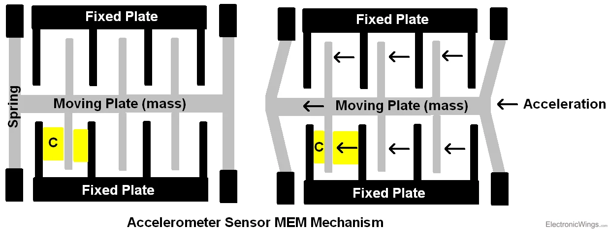

# Accelerometer ADXL335
An accelerometer is an electromechanical device that will measure acceleration force. it measure it by relaying on gravity.

- Basic structure of accelerometer consists fixed plates and moving plates (mass).

-  Acceleration deflects the moving mass and unbalances the differential capacitor which results in a sensor output voltage amplitude which is proportional to the acceleration.

-  These techniques are then used to determine the magnitude and direction of the acceleration.
If i want to calculate which axes you are in you need to chose from the data sheet the vrefrance ,ZERO g BIAS LEVEL (RATIOMETRIC) ,Sensitivity at XOUT YOUT ZOUT.

the rule used:

Aixesout = (((axis you choosed ADC value * Vref) / 1024) – zero g) / sensitivity.
 