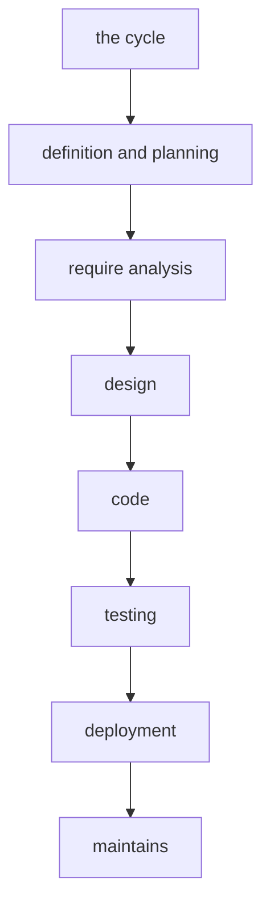

# Software Development Life Cycle (SDLC) 
1-what is sdlc why we need it 

2- sdlc phase

3-sdlc model

 1. what are the catagory

 2. what are the model

 

1-what is sdlc why we need it 

if we dont have a system these might happen :

* 2 might do the same task this is called chaos. 

* misunderstanding of the task or project or the team. 

* delay because they dont follow a plan. 

* bugs can show because there is no system.

__sdlc definition__
sdlc stand for Software Development Life Cycle
it is a frame work or process to build software system correctly .

* history 

in the 60, they used to have idea try to code a solve its bug that was called ad.hoc 

and over budget showed up there was also delay or fail because there was no system to work on thats how structed development showed.

in the 70, wintson made water fall model where Winston said that it only work with a certain type of project only because it might fail if used with other projects.

why we need it ?

|without sdlc |with sdlc| 
|-------------|---------|
|1- multiworkflow 
2-no documentation as a reference
3- bugs
4-complex maintaince 
           |1-one workflow
2-quality code because there will be document
3-tracking for the workflow
|

2- sdlc phase

graph TD;

1-definition and planning //do this in differnet way
you have an idea it make a project over view for it then you start planning if you want to do it or no 
and if the budget and resorce are ok then a project over view is done .
we do definition for what we need to know about the product we have 3 name for the product maker he can be business analyst ,product owner ,require engineer then you get output called customer requirement specification for short __"CRS"__ this folder go to chef engineer and he see if this project can be done by hardware or software if we used software we git something from it called __"SRS"__ software requirement specification if hardware"HRS" hardware requirement specification .

2-requirement analysis 

|team lead S.W|team lead H.W|team lead testing|
|-------------|-------------|-----------------|
|they take the SRS,HRS,CRS folder| they take the SRS,HRS,CRS folder|they take the SRS,HRS,CRS folder              | 
* reject requirement reasons 
1- no enough experience 

2- requirement cancel each other 

3- no environment tool for testing 

* after rejection 
you go to chef engineer if he have solution good if no they ask the client to understand from him then you get a new CRS,SRS and analysis.

*requirement type //not with the phase it is a tip & trick
                          
 1. function requirement is: what do the system do 

 2. non function requirement is: system  quality ,performance and safety.

3- Design

1. high level design "HLD" consist of system design

2. low level design consists of model and architecture 

1.1. system design"HLD" make the final structure that consist of :

1.1.1. final component
1.1.2. version

2.2.1. architecture design:
2.2.1.1. static tell us type of layer, software components, API's and description of what i want .
 
2.2.1.2. dynamic tell us the memory usage ,execution time ,RTOS .

* module design "flow chart"
flow chart came from language called UML "unified modeling language"
 UML consist of flowchart ,action diagram, state machine, class diagram 

__design out put HLS,LLD,UML diagrams.__

4-Implementation

 here we do coding for the whole system 

the output is the code.

5-Validation or testing

1-testing level
 1. unit test  is to test small unit of code ,function, some of the lines.
2. integration test :make sure that every communication work.
3. system test : try the whole system in real environment .
4. acceptance test : see if the system and the requirement are the same.
//interview question
* verification : is are we building the product right
meaning does the requirement match the design match the code.
* validation : is are we building the right product ?
here we make sure that the system match the client requirement .

6- Deployment and maintains
deployment :mean flashing the firmware to the ECU 

maintains is bug fixing meaning production bug 

* documentation for each phase 
1-definition and planning 
1. project characteristics in here you define the objectives ,general scope, project over view.

2. project plan contain timeline ,budget, resources.

3. CRS "customer requirement specification" it need client confirmation.

2-require analysis 
1. SRS "software requirement specification".

2. HRS "hardwre requirement specification".

3-design
1. HLD"high level design".

2. SDD "software design document".

3. LLD "low level design".

4. UML digrame.

4-code
1. source code documentation :the comment on the code and the comment type is doxygen style .

2. API's documentation :it explain what actually happens.

5-testing
1. test plan : test strategy meaning what will be test ,who will test ,the tool used in the test .

2. test cases :details steps of the cases.

3.bug/test report.

6-deployment
1. deployment plan:plan on how to publish your system.

2. release note :file that explain the new features and solved bug.

3.user manual .

7-maintains
1. issue log :file that track all the issues like when they should up.

2.change request :file with new features.

